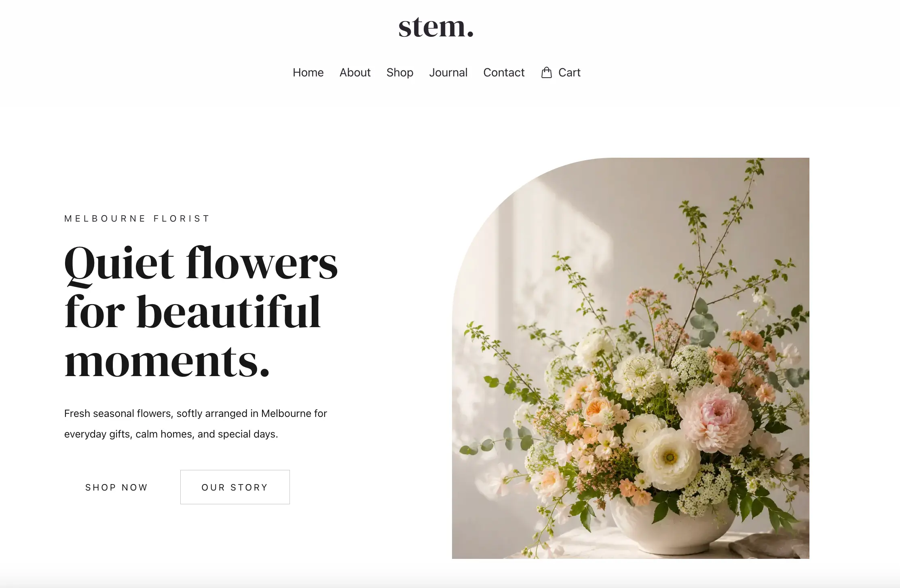

# stem.

Minimal floral e-commerce concept website built with Next.js.  

This project was created as part of an Information Architecture coursework assessment.

## Live Demo

https://stem-flower.vercel.app

## Preview

## Built With

- Next.js
- React
- Tailwind CSS
- DaisyUI
- Google Analytics

## Features

- Responsive design
- Dynamic product pages
- Single-item localStorage shopping cart
- SEO optimisation
- Accessibility improvements
- Mobile-friendly layout

## Learning Focus

- Information Architecture
- Quality Assurance
- Next.js workflows
- Responsive UI design

## Notes

- This project is a front-end concept website created for educational purposes.
- The shopping cart currently supports single-item localStorage functionality.
- Checkout and payment processing are not implemented.
- All website images used in this project were AI-generated for educational and mockup purposes.
- Website planning included sitemap creation, wireframes, style guides, and UI prototyping.
- The final UI prototype was designed using v0 before development.

## Deployment

Deployed with Vercel.

## Future Improvements

- Multi-item shopping cart
- Backend integration
- Payment gateway support
- CMS integration

## Author

GitHub: https://github.com/yukicode26